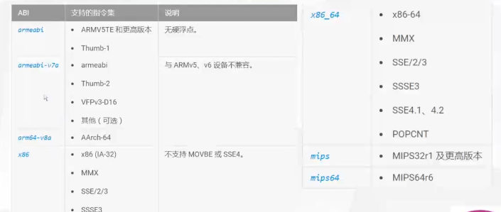

### 安卓NDK

**ABI包含以下信息**

- cpu指令集
- 内存字节顺序
- 可执行二进制文件的格式
- 解析的各种约定，对齐限制，堆栈使用和

**android 支持的ABI**

### NENO

neno 提供一组标量/矢量指令和寄存器 armeabi 默认

armeabi-v7a (NENO)

-mfpu=vfp 浮点协处理器

-mfpu=neno

-march=armv7-a

### ffmpeg cnfigure android

- --prefix 输出目录
- --enable 开启模块 ，硬解码,neno
- --disable 禁止模块  禁止 ffmpeg 工具
- 交叉编译参数 cross-prefix arch target cpu sysroot extra-cflags

