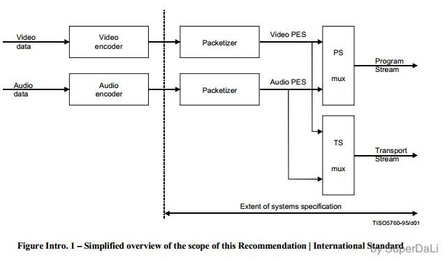
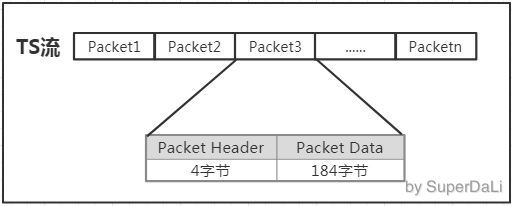

## 封装格式

### 概念

avi，rmvb，mp4，flv，mkv 这些格式代表的是**封装格式**

**何为封装格式**？就是把视频数据和音频数据打包成一个文件的规范。仅仅靠看文件的后缀，很难能看出具体使用了什么**视音频编码标准**。总的来说，不同的封装格式之间差距不大，各有优劣。

### 看一个视频文件采用的视音频技术

在这里使用**Media Player Classic**作为演示，实际上暴风影音，KMplayer这些操作都差不太多。

也可以使用 **MediaInfo** 查看视频信息

在弹出的“属性”对话框的“MediaInfo”选项卡中，就可以查看该视频文件采用的视音频技术了。如下图所示，“变形金刚预告片_h1080p.mov”采用MPEG4的QuickTime封装格式（MOV），采用了H.264（AVC）的压缩编码标准

**MediaInfo是一个专门查看视音频格式的工具**

MediaInfo源码

https://blog.csdn.net/leixiaohua1020/article/details/12016231

| 名称(文件扩展名)  | 推出机构           | 流媒体 | 支持的视频编码               | 支持的音频编码                     | 目前使用领域   |
| :---------------- | :----------------- | :----- | :--------------------------- | :--------------------------------- | :------------- |
| AVI(.avi)         | Microsoft 公司     | 不支持 | 几乎所有格式                 | 几乎所有格式                       | BT 下载影视    |
| Flash Video(.flv) | Adobe 公司         | 支持   | Sorenson/VP6/H.264           | MP3/ADPCM/Linear PCM/AAC 等        | 互联网视频网站 |
| MP4(.mp4)         | MPEG 组织          | 支持   | MPEG-2/MPEG-4/H.264/H.263 等 | AAC/MPEG-1 Layers I,II,III/AC-3 等 | 互联网视频网站 |
| MPEGTS(.ts)       | MPEG 组织          | 支持   | MPEG-1/MPEG-2/MPEG-4/H.264   | MPEG-1 Layers I,II,III/AAC         | IPTV，数字电视 |
| Matroska(.mkv)    | CoreCodec 公司     | 支持   | 几乎所有格式                 | 几乎所有格式                       | 互联网视频网站 |
| Real Video(.rmvb) | Real Networks 公司 | 支持   | RealVideo 8,9,10             | AAC/Cook Codec/RealAudio Lossless  | BT 下载影视    |

### 查看FFmpeg支持的封装格式	

使用`ffmpeg -formats`命令可以查看FFmpeg支持的封装格式

## MPEG2-TS 标准分析

### 概念

**ES流（Elementary Stream）**：**基本码流**，经过编码后的连续码流。

**PES流**（Pakckaged Elementary Stream）：**将ES流分割成段，加上相应的头文件打包后的码流**。PES包的长度可变，包头中最重要的是PTS（Presentation Time Stamp）、和DTS（Decode Time Stamp）时间，再加上参考PCR参考时钟，播放器便能**从PES流中重建音视频。**

**TS流（Transport Stream）**：**固定包长度为188**B，将一个或多个PES包组合到一起用于传输的单一码流。

TS的名称实际上是**MPEG2-TS**，在iso13818-1文档中定义，TS是Transport Stream的缩写，意为**传输流**，用于传输混合后的多媒体数据流。在MPEG2标准中，**有两种不同类型个码流标准**，一是节目码流（PS即 Program Stream），另外一个就是TS流。在MPEG2标准中，给出两种不同类型码流的形成过程。

1. Video或者Audio原始数据，通过音视频编码器编码后形成ES流。
2. 通过打包器（Packatizer）添加上PTS、DTS等信息后，打包成PES包。
3. 分别打包好后的音频PES包和视频PES包经过PS/TS复用处理后，分别形成**PS流**和**TS流**。

### TS流包含的内容

我们之所以要解析TS流，目的就是从流中**获取我们需要的编码数据、时钟等信息从而在接收设备中重建音视频。**而所谓的TS流，实际上就是基于**Packet形成的Byte位流，由一个个包形成**。

**一段PS流，必然包含PAT包、PTM包、多个音频…**

https://blog.csdn.net/leixiaohua1020/article/details/18893769