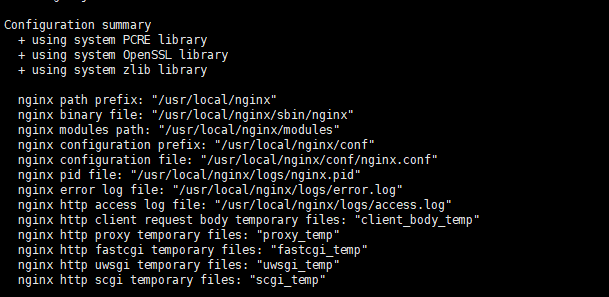

### **nginx + rtmp** 


1 ,wget https://nginx.org/download/nginx-1.16.1.tar.gz

2,apt-get install libpcre3-dev 

3,./configure --add-module=/root/nginx/nginx-rtmp-module/

在ubuntu软件源里zlib和zlib-devel叫做zlib1g zlib1g.dev

$ sudo apt-get install zlib1g

$ sudo apt-get install zlib1g.dev 

如下：配置成功



4， make ,make install  安装到  usr/local/nginx   。 如果以前存在，有可能不会覆盖，就清掉，

rm /usr/local/nginx/  -r


5. 进入 usr/local/nginx/sbin  , ./nginx 运行。

 ps -ef|grep ngin  查看是否运行

6，访问ip 看到成功页面。

7. 配置rtmp module


8，推流测试 ,vlc 播放。

**ffmpeg -i test.mp4 -f flv rtmp://xx.233.39.117/live/test**

这里有可能是模糊的，这里是重新编码。

指定不编码

ffmpeg -i test.mp4  -c copy -f flv rtmp://xx.233.39.117/live/test

不要解码再重新编码，只做flv 的重封装，封装之后，就通过网络推出去。

9， 通过网页看直播推流的状态

一定要把 stat.xsl 拷贝到 /usr/local/nginx/html 目录。

```xsl
http {
    include       mime.types;
    default_type  application/octet-stream;

    #log_format  main  '$remote_addr - $remote_user [$time_local] "$request" '
    #                  '$status $body_bytes_sent "$http_referer" '
    #                  '"$http_user_agent" "$http_x_forwarded_for"';

    #access_log  logs/access.log  main;

    sendfile        on;
    #tcp_nopush     on;

    #keepalive_timeout  0;
    keepalive_timeout  65;

    #gzip  on;
        server {
        listen       80;
        server_name  localhost;

        #charset koi8-r;
        location /stat {
                rtmp_stat all;
                rtmp_stat_stylesheet stat.xsl;
        }
        location /stat.xsl {
                root /usr/local/nginx/html/;

        }

        #access_log  logs/host.access.log  main;

        location / {
            root   html;
            index  index.html index.htm;
        }

```

