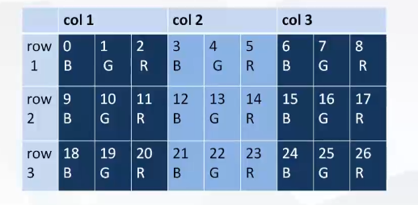

### **opencv 读取视频**

```
VideoCapture 
bool open(int index)
VideoCapture cap(index)
open(int cameraNum,int apiPreference) //指定什么样的设备
```

视频源可以是**摄像机，文件，rtsp 流**，统一是这样一个类，来处理所有视频源。包括读取的接口。


### **创建和清理Mat空间**

```
Mat mat(3000,4000,CV_8U3C)
mat.create(rows,cols,CV_8UC1)
release 或者西沟 
引用计数为1时，释放

```

### 3x3RGB图像存放方式（连续）

、

**连续：可以用一个数组来存放整个矩阵。内存的存放方式是BGR形式。**

**不连续：一行还是 如图 1,2,3,4,5,6,7,8 第二行的时候，开始位置不一定接着第一行的结束位置**。

mat 内部有一个step,如何去换行。包括一些情况，跟mat 创建参数有关，可能会对齐，一行的后面会补一些空的。这一行的数据是一个对齐的数据，也会造成不连续的。

**opencv本身提供了函数判断是否是连续的**。

```
isContinuous 判断存储空间是否连续
```

如果不连续，**通过step 记录，判断每一行的数据，到下一行间隔多少**。

有时候，直接访问这个数组，总是不对，**要判断是否是连续的**。

**遍历访问的时候，判断是连续的还是非连续的。**

### 直接地址访问连续空间

```
//连续空间的大小
int size = mat.rows*mat.cols*mat.elemSize(); //mat.elemSize() 元素的大小，rgb 是3，灰度就是1.
for(int i =0 ; i < size;i+=3){
	mat.data[i] = 255;    // B
	mat.data[i+1] = 0;  // G
	mat.data[i+2]  =0;   //R
}

```

### 读取一帧视频

```
read(OutputArray image)  //摄像机视频，或者文件视频都是同一个接口 返回bool 类型
传递mat 就会把这一帧 读取到mat 里面。
```

除了读取视频帧之外，还做了解压（解码），解码之后，有可能是yuv的图像，接着转换rgb 。

其实做了多件事情。

read的内部调用了两个函数

- **grab()读取并解码** 
  - 读了一帧数据，放到packet里面。
  - 读完之后，进行了解码。avcodec_decode_video,解码之后，frame_number++ ,pts 也进行了运算。最后，返回成功还是失败。解码的帧和读出的帧并没有开放出来。


- **retrieve(OutputArray image，int flag =0);图像色彩转换**
  - 图像色彩转换，最终形成了rgb的图像。
  - 把YUV的转换成AV_PIX_FMT_BGR24，转换之后，把这个对象写入image.

**为什么要把read分成两个接口？什么情况下分开调用？分开调用有什么好处？**

一个画面有可能是300帧每秒，300帧是不是都需要把这些做一遍呢？可以不需要。

所有的解码（grab），**但是每5帧调用一次retrieve .这样只显示60帧每秒。**这样效率更高

为什么300帧，每帧都要解吗呢？

**如果是mjpeg 这种格式，这种格式，每一帧都是独立的，是基于jpeg 出来的。它的压缩率其实不高，**

**同等大小的视频，它的质量要比h264低很多**。

**h264,一帧是jpge 压缩，后面比如50帧画面，存的是这帧画面的变化。所以这样的压缩率是非常高的**

比如1s 300帧，可能每帧之间的变换并不大。压缩率非常高。

这样也存在一个问题，**必须每一帧都解码。可以把前面都解码，但是不做图像转换。**不显示，提升操作效率。


