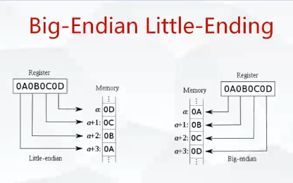

### 音频基础知识参数分析

**采样率**：sample_rate 44100 (CD) **越大声音越细腻**。1s 采样44100次。

**通道** ： channels (左右声道)

**样本大小**（格式）sample_size  样本里面包含了格式大小 ，**正常的音频都是基于S16 来存放。**

**如果要压缩成h264配套的音频，aac格式，必须要重采样到FLTP格式**，否则转aac不支持。正常声卡，是录制不到FLTP的。普通的声卡，最多24位，很少有32位的。音频采样之后，还要进行重采样。

**FLTP  中 P的概念**：平面的概念，这是样本存放的方式，yuv也存在这样的概念。

**AV_SAMPLE_FMT_S16** 16位

**AV_SAMPLE_FMT_FLTP** 32位  float 表示

**AV_SAMPLE_FMT_S16**在内存的格式为：(1，2通道交错存的)

c1,c2,c1,c2,c1,c2  

**AV_SAMPLE_FMT_S16P**在内存的格式为：（1通道存完再存2通道，这就是P的概念 平面存储，单通道就不存在这个问题了）

c1,c1,c1.....c2,c2,c2 ...

 

**Big-Endian Little-Ending** 

 **默认都是小端格式，在录制的时候，设置为小端模式**。

就是字节的存储顺序问题。后面的音频数据，都是以小端模式。

**nb_samples 一帧数据量**

为什么有这样的概念？如果是纯音频的话，不需要这样的概念，因为它是个线性数据，跟视频不一样，视频是一帧一帧的。比如：1秒25帧。但是音频不存在这样的问题，音频的1s 是44100个采样。有时候要做音视频同步，也要保证，数据存放方式和视频有一定的一致性，也是一帧一帧存放的。ffmpeg 中 使用avPacket 存放的，包含了一帧的音频量，对应的就是采样数量

比如：

**1024 单通道的样本数量**（**1帧采样了多少次**）

就可以推算帧率就是 44100/1024=  43.066 帧率

**所以音视频很难做到完全一致的，是存在浮点数在里面的。pts 运算时分开做的，然后再一起做同步。**

一秒音频的大小 44100x2x2 = 172.26kb  2个通道(双通道立体声) 乘以2, 16位 2个字节，再乘以2

一帧音频的大小 1024x2x2 = 4096b;

### qt的几个接口

