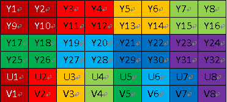

### **介绍一下摄像头的数据流格式**

参考地址 ：https://www.cnblogs.com/samaritan/p/YUV.html

参考地址：https://www.cnblogs.com/tid-think/p/10616789.html

视频流的转换，**android中一般摄像头的格式是NV21或者是NV12**，它们都**是YUV420sp的一种**，那么什么是YUV格式呢？

何为YUV格式，有三个分量，**Y表示明亮度，也就是灰度值，U和V则表示色度**，即影像色彩饱和度，用于指定像素的颜色，（直接点就是Y是亮度信息，UV是色彩信息），YUV格式分为两大类，planar和packed两种

```
对于planar的YUV格式，先连续存储所有像素点Y，紧接着存储所有像素点U，随后所有像素点V
对于packed的YUV格式，每个像素点YUV是连续交替存储的
```

#### YUV采样

**YUV特点**：也是一种颜色编码方法，它将亮度信息（Y）与色彩信息（UV）分离，没有UV信息一样 可以显示完整的图像，只不过是黑白的，这样的设计很好地解决了**彩色电视机与黑白电视的兼容问题**。并且，YUV不像RGB那样要求三个独立的视频信号同时传 输，所以用**YUV方式传送占用极少的频宽**。


YUV格式为什么后面还带数字呢，比如YUV 420，444，442

YUV444：**每一个Y对应一组UV分量 都为1个字节**
YUV422：**每两个Y共用一组UV分量 **
YUV420：**每四个Y公用一组UV分量 **

**实际上NV21，NV12就是属于YUV420，是一种two-plane模式**，即Y和UV分为	两个Plane，UV为交错存储，他们都属于YUV420SP，举个例子就会很清晰了

```
NV21格式数据排列方式是YYYYYYYY（w*h）VUVUVUVU(w*h/2)，
对于NV12的格式，排列方式是YYYYYYYY（w*h）UVUVUVUV（w*h/2）
NV12: YYYYYYYY UVUV    =>YUV420SP
NV21: YYYYYYYY VUVU    =>YUV420SP
```


正如代码注释中所说的那样，我们以标准的YUV420P为例，对于这样的格式，我们要取出Y，U，V这三个分量，我们看怎么取？


```
比如480 * 640大小的图片，其字节数为 480 * 640 * 3 >> 1个字节
Y分量：480 * 640个字节
U分量：480 * 640 >>2个字节
V分量：480 * 640 >>2个字节，加起来就为480 * 640 * 3 >> 1个字节
存储都是行优先存储，三部分之间顺序是YUV依次存储，即
0 ~ 480*640是Y分量；480 * 640 ~ 480 * 640 * 5 / 4为U分量；480 * 640 * 5 / 4 ~ 480 * 640 * 3 / 2是V分量，
```

记住这个计算方法，等下在JNI中马上会体现出来

#### 像素格式

像素格式的知识此前已经记录过，不再重复。在这里记录一下FFmpeg支持的像素格式。有几点注意事项：
（1）       **所有的像素格式的名称都是以“AV_PIX_FMT_”开头**
（2）       **像素格式名称后面有“P”的，代表是planar格式，否则就是packed格式。**Planar格式不同的分量分别存储在不同的数组中，例如AV_PIX_FMT_YUV420P存储方式如下：

data[0]: Y1, Y2, Y3, Y4, Y5, Y6, Y7, Y8……
data[1]: U1, U2, U3, U4……
data[2]: V1, V2, V3, V4……

Packed格式的数据都存储在同一个数组中，例如AV_PIX_FMT_RGB24存储方式如下：

data[0]: R1, G1, B1, R2, G2, B2, R3, G3, B3, R4, G4, B4……

https://blog.csdn.net/leixiaohua1020/article/details/42134965

#### **yuv420SP**

那么YUV420SP和YUV420P的区别在哪里呢？显然Y的排序是完全相同的，但是UV排列上原理是完全不同的，420P它是先吧U存放完后，再放V，也就是说UV是连续的，而420SP它是UV，UV这样交替存放：
 **YUV420SP格式：**


所以NV21(YUV420SP)的数据如下:
 同样的以480 * 640大小的图片为例，其字节数为 480 * 640 * 3 >> 1个字节
 Y分量：480 * 640个字节
 UV分量：480 * 640 >>1个字节(注意，我们没有把UV分量分开)
 加起来就为480 * 640 * 3 >> 1个字节

下面我们来看看两个JNI函数，这个是摄像头转化的两个最关键的函数


```
/**
     * NV21转化为YUV420P数据
     * @param src         原始数据
     * @param width       原始数据宽度
     * @param height      原始数据高度
     * @param dst         生成数据
     * @param dst_width   生成数据宽度
     * @param dst_height  生成数据高度
     * @param mode        模式
     * @param degree      角度
     * @param isMirror    是否镜像
     * @return
     */
    public static native int compressYUV(byte[] src, int width, int height, byte[] dst, int dst_width, int dst_height, int mode, int degree, boolean isMirror);

    /**
     * YUV420P数据的裁剪
     * @param src         原始数据
     * @param width       原始数据宽度
     * @param height      原始数据高度
     * @param dst         生成数据
     * @param dst_width   生成数据宽度
     * @param dst_height  生成数据高度
     * @param left        裁剪的起始x点
     * @param top         裁剪的起始y点
     * @return
     */
    public static native int cropYUV(byte[] src, int width, int height, byte[] dst, int dst_width, int dst_height, int left, int top);

```


 

```
JNIEXPORT jint JNICALL Java_com_riemannlee_liveproject_StreamProcessManager_compressYUV
    (JNIEnv *env, jclass type,
     jbyteArray src_, jint width,
     jint height, jbyteArray dst_,
     jint dst_width, jint dst_height,
     jint mode, jint degree,
     jboolean isMirror) {

    jbyte *Src_data = env->GetByteArrayElements(src_, NULL);
    jbyte *Dst_data = env->GetByteArrayElements(dst_, NULL);
    //nv21转化为i420(标准YUV420P数据) 这个temp_i420_data大小是和Src_data是一样的
    nv21ToI420(Src_data, width, height, temp_i420_data);
    //进行缩放的操作，这个缩放，会把数据压缩
    scaleI420(temp_i420_data, width, height, temp_i420_data_scale, dst_width, dst_height, mode);
    //如果是前置摄像头，进行镜像操作
    if (isMirror) {
        //进行旋转的操作
        rotateI420(temp_i420_data_scale, dst_width, dst_height, temp_i420_data_rotate, degree);
        //因为旋转的角度都是90和270，那后面的数据width和height是相反的
        mirrorI420(temp_i420_data_rotate, dst_height, dst_width, Dst_data);
    } else {
        //进行旋转的操作
        rotateI420(temp_i420_data_scale, dst_width, dst_height, Dst_data, degree);
    }
     env->ReleaseByteArrayElements(dst_, Dst_data, 0);
    env->ReleaseByteArrayElements(src_, Src_data, 0);

    return 0;
    }
```

我们从java层传递过来的参数可以看到，原始数据是1080 * 1920，先转为1080 * 1920的标准的YUV420P的数据，下面的代码就是上面我举的例子，如何拆分YUV420P的Y，U，V分量和如何拆分YUV420SP的Y，UV分量，最后调用libyuv库的libyuv::NV21ToI420数据就完成了转换；然后进行缩放，调用了libyuv::I420Scale的函数完成转换。


```
//NV21转化为YUV420P数据
void nv21ToI420(jbyte *src_nv21_data, jint width, jint height, jbyte *src_i420_data) {
    //Y通道数据大小
    jint src_y_size = width * height;
    //U通道数据大小
    jint src_u_size = (width >> 1) * (height >> 1);

    //NV21中Y通道数据
    jbyte *src_nv21_y_data = src_nv21_data;
    //由于是连续存储的Y通道数据后即为VU数据，它们的存储方式是交叉存储的
    jbyte *src_nv21_vu_data = src_nv21_data + src_y_size;

    //YUV420P中Y通道数据
    jbyte *src_i420_y_data = src_i420_data;
    //YUV420P中U通道数据
    jbyte *src_i420_u_data = src_i420_data + src_y_size;
    //YUV420P中V通道数据
    jbyte *src_i420_v_data = src_i420_data + src_y_size + src_u_size;

    //直接调用libyuv中接口，把NV21数据转化为YUV420P标准数据，此时，它们的存储大小是不变的
    libyuv::NV21ToI420((const uint8 *) src_nv21_y_data, width,
                       (const uint8 *) src_nv21_vu_data, width,
                       (uint8 *) src_i420_y_data, width,
                       (uint8 *) src_i420_u_data, width >> 1,
                       (uint8 *) src_i420_v_data, width >> 1,
                       width, height);
}

//进行缩放操作，此时是把1080 * 1920的YUV420P的数据 ==> 480 * 640的YUV420P的数据
void scaleI420(jbyte *src_i420_data, jint width, jint height, jbyte *dst_i420_data, jint dst_width,
               jint dst_height, jint mode) {
    //Y数据大小width*height，U数据大小为1/4的width*height，V大小和U一样，一共是3/2的width*height大小
    jint src_i420_y_size = width * height;
    jint src_i420_u_size = (width >> 1) * (height >> 1);
    //由于是标准的YUV420P的数据，我们可以把三个通道全部分离出来
    jbyte *src_i420_y_data = src_i420_data;
    jbyte *src_i420_u_data = src_i420_data + src_i420_y_size;
    jbyte *src_i420_v_data = src_i420_data + src_i420_y_size + src_i420_u_size;

    //由于是标准的YUV420P的数据，我们可以把三个通道全部分离出来
    jint dst_i420_y_size = dst_width * dst_height;
    jint dst_i420_u_size = (dst_width >> 1) * (dst_height >> 1);
    jbyte *dst_i420_y_data = dst_i420_data;
    jbyte *dst_i420_u_data = dst_i420_data + dst_i420_y_size;
    jbyte *dst_i420_v_data = dst_i420_data + dst_i420_y_size + dst_i420_u_size;

    //调用libyuv库，进行缩放操作
    libyuv::I420Scale((const uint8 *) src_i420_y_data, width,
                      (const uint8 *) src_i420_u_data, width >> 1,
                      (const uint8 *) src_i420_v_data, width >> 1,
                      width, height,
                      (uint8 *) dst_i420_y_data, dst_width,
                      (uint8 *) dst_i420_u_data, dst_width >> 1,
                      (uint8 *) dst_i420_v_data, dst_width >> 1,
                      dst_width, dst_height,
                      (libyuv::FilterMode) mode);
}
```


至此，我们就把摄像头的NV21数据转化为YUV420P的标准数据了，这样，我们就可以把这个数据流转化为H264了，接下来，我们来看看如何把**YUV420P流数据转化为h264数据，从而为推流做准备**


#### YUV420P

**(YU12和YV12)格式**

**YUV420P又叫plane平面模式**，Y , U , V分别在不同平面，也就是有三个平面，它是YUV标准格式4：2：0，主要分为：**YU12和YV12**




##### **YU12格式 I420 标准**

```
在android平台下也叫作I420格式，首先是所有Y值，然后是所有U值，最后是所有V值。
```


##### **YV12格式**

```
YV12格式与YU12基本相同，首先是所有Y值，然后是所有V值，最后是所有U值。只要注意从适当的位置提取U和V值，YU12和YV12都可以使用相同的算法进行处理。
YV12：亮度Y(行×列) + V(行×列/4) + U(行×列/4)

YU12: YYYYYYYY UUVV    =>    YUV420P
YV12: YYYYYYYY VVUU    =>    YUV420P

```

#### two-plane

**我们在android平台下使用相机默认图像格式是NV21属于YUV420SP格式## YUV420SP(NV21和NV12)格式**

`YUV420SP`格式的图像阵列，首先是所有`Y值`，然后是`UV`或者`VU`交替存储，`NV12和NV21属于YUV420SP`格式，是一种`two-plane模式`，即`Y和UV分为两个plane`，但是`UV(CbCr)`为交错存储，而不是分为三个平面

### YUV422

#### **YUVY 格式 （属于YUV422）**

**YUYV为YUV422**采样的存储格式中的一种，相邻的两个Y共用其相邻的两个Cb、Cr，分析，对于像素点Y'00、Y'01 而言，其Cb、Cr的值均为 Cb00、Cr00，其他的像素点的YUV取值依次类推。

####  **UYVY 格式 （属于YUV422）**

**UYVY格式也是YUV422**采样的存储格式中的一种，只不过与YUYV不同的是UV的排列顺序不一样而已，还原其每个像素点的YUV值的方法与上面一样

#### **YUV422P（属于YUV422)**

**UV422P 也属于YUV422**的一种，它是一种Plane模式，即平面模式，并不是将YUV数据交错存储，而是先存放所有的Y分量，然后存储所有的U（Cb）分量， 最后存储所有的V（Cr）分量，如上图所示。其每一个像素点的YUV值提取方法也是遵循YUV422格式的最基本提取方法，即两个Y共用一个UV。比如， 对于像素点Y'00、Y'01 而言，其Cb、Cr的值均为 Cb00、Cr00。

### AV_PIX_FMT_YUV420P与AV_PIX_FMT_YUVJ420P

YUVJ420P的字面含义是“使用了JPEG颜色范围的YUV420P，像素使用表示颜色的数值范围发生了变化。
YUV420p**的像素颜色范围是[16,235]，16表示黑色，235表示白色**
YUVJ420P**的像素颜色范围是[0,255]。0表示黑色，255表示白色**

### 

YUV420p对应的是电视。
YUVJ420P对应的是显示器。


百度百科

1）相同为4:4:4

YUV，因此，所生成的图像信息中的每个像素的三个组成部分是完整的（8位）的的的的三个通道的采样率通常情况下，每个组件是经过量化后，每个像素占用3个字节未压缩的8位。
以下四个像素：[Y0 U0 V0] [Y1 U1 V1] [Y2 U2 V2] [Y3 U3 V3
存储流：Y0 U0 V0 Y1 U1 V1 Y2 U2 V2 Y3 U3 V3
（2）YUV 4:2:2
每个色度通道的采样率是亮度通道的一半，所以水平方向的色度采样率只是4:4:4的一半。对于非压缩的8 - 比特量化的图像，每个像素相邻的两个水平方向上的宏像素组成的需要4个字节的存储器。
以下四个像素：[Y0 U0 V0] [Y1 U1 V1] [Y2 U2 V2] [Y3 U3 V3
存储流：Y0 U0 Y1 V1 Y2 U2 Y3 V3
映射像素： Y0 U0 V1] [Y1 U0 V1] [Y2 U2 V3] [Y3 U2 V3]
（3）YUV 4:1:1
4:1：1色度取样，为4:1的水平方向上的色度采样。对于低端用户和消费类产品，这仍然是可以接受的。 4在水平方向上的每个相邻像素组成的宏像素需要6个字节的非压缩的8 - 比特量化的视频。
以下四个像素：[Y0 U0 V0] [Y1 U1 V1] [Y2 U2 V2 [Y3 U3 V3]
存储流为：Y0 U0 Y1 Y2 V2 Y3 </映射像素：[Y0 U0 V2] [Y1 U0 V2] [Y2 U0 V2] [Y3 U0 V2]
（4）YUV4：
4:2:0，2:0不意味着，只有Y，Cb和Cr分量。它是指对于每条扫描线，存储只有一个色度分量的采样速率为2:1。相邻的扫描线存储色差分量，即，如果一行是4:2:0，下一行是4点00分02秒，然后下一行是4:2:0 ...等。对于每个色度分量，在水平方向和垂直方向上的采样率是2:1，也可以说，色度采样率是4:1。对于压缩的8位量化的视频中，各组成的两行和两列中，相邻像素中邻接的2×2的宏像素需要6个字节的存储器。
以下八个像素：[Y0 U0 V0] [Y1 U1 V1] [Y2 U2 V2 [Y3 U3 V3]
[Y5 U5 V5] [Y6 U6 V6发动机[Y7U7 V7] [Y8 U8 V8] BR />流存储：Y0 U0 Y1 Y2 U2 Y3
Y5 V5 Y6 Y7 V7 Y8
像素映射出点：[Y0 U0 V5] [Y1 U0 V5] [Y2 U2 V7] [Y3 U2 V7]
[Y5 U0 V5] [Y6 U0 V5] [Y7U2 V7] [Y8 U2 V7]