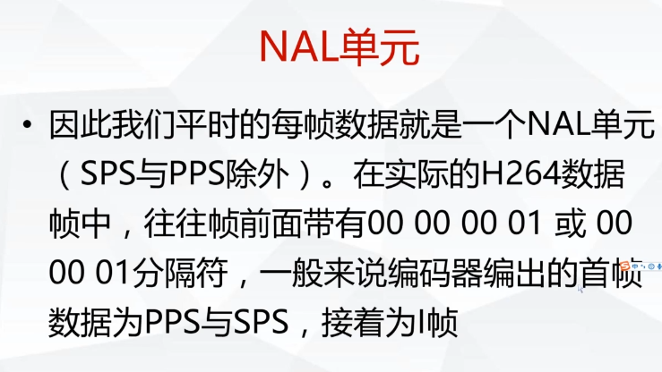

### MPEG-4

MPEG-4 是一套用于音频，视频信息的压缩编码标准。

mp4 的文件不等同与MPEG-4标准

MPEG-4 Part 14  MPE-4 文件格式  （不等同与 mp4 只是其中一个部分 mp4 位于14 部分）

MPEG-4 Part 15 AAC 文件格式。

H264 (AVC Part10)

### 常用封装格式

AVI 压缩标准可任意选择

很开放的一个标准，存放任意的压缩格式，没有作限定。甚至可以存放没有压缩的文件。原始数据非常大，现在用的少，这种格式没法确定标准。

FLV ts 流媒体格式  做电视 一般基于ts 流

ASF  

MP4  MPEG-4  定义好的一种封装格式

### 常用编码格式

 视频 H264 (AVC Part10) ,wmv, XviD(Part2) ,mjpeg 

音频 aac  mp3 ape flac 

aac mp3 都是有损压缩。

ape 无损压缩

ffmpeg 中 有几种格式转换。

1，ffmpeg 自带接口实现了这个算法。

2，使用neno 协议处理器来转换。

3,   显卡 shader 来转换，不浪费cpu资源，而且性能比较高。显卡的浮点运算 是远远的高于cpu 的。

压缩解码，显卡并不比cpu 强。

 坑：

为了提高算法的效率，做了每一行的对齐操作。每一行的结尾会补。

如果4字节对齐，第一行 补 9，10,11  第二行 从12 开始的。在做像素格式复制的时候，

一行一行的数据复制，这样效率会低。如果不想一行行复制，保证是4 或者 8 的倍数。1280 ，1920 都是 。如果确定 可以 整块复制。

**y u v**

软解码性能会差？指的是嵌入式cpu ,它的软解码确实是差。 现在都是8核 2.0  所以他的解码性能和兼容性一般都是强于硬解码的。硬解码是固定死的，比如就只能解码60 帧每秒。固化的程序，不需要做指令转换，cpu 开销就小，热功耗非常小，省电。没有特殊需求的比如（200帧每秒）,硬解码肯定解不了。

硬解码和软解码出来的yuv 格式 有时候，会不一样。

### pcm 音频参数

采样率 sample_rate 44100 

通道 channels （左右声道）

样本大小（格式） sample_size

AV_SAPLE_FMT_S16           16byte

AV_SAMPLE_FMT_FLTP     32 byte

### 样本类型

AV_SAMPLE_FMT_S16 在内存的格式为： c1,c2,c1,c2,c1,c2.....

AV_SAMPLE_FMT_S16 在内存的格式为： c1,c1,c1 .... c2 ,c2 ,c2..

### MP4格式分析

### H264/AVC视频编码标准

视频编码层面（VCL）

- 视频数据的内容

网络抽象层面（NAL）

- 格式化数据并提供头信息

IDR（Instantaneous Decoding Refresh）--即时解码刷新。 

帧:帧内编码帧是一种自带全部信息的独立帧，无需参考其它图像便可独立进行解码，视频序列中的第一个帧始终都是I帧。 

   **I和IDR帧都是使用帧内预测的。它们都是同一个东西而已,在编码和解码中为了方便，要首个I帧和其他I帧区别开，所以才把第一个首个I帧叫IDR**，这样就方便控制编码和解码流程。 IDR帧的作用是立刻刷新,使错误不致传播,从IDR帧开始,重新算一个新的序列开始编码。而I帧不具有随机访问的能力，这个功能是由IDR承担。 IDR会导致DPB（DecodedPictureBuffer 参考帧列表——这是关键所在）清空，而I不会。IDR图像一定是I图像，但I图像不一定是IDR图像。一个序列中可以有很多的I图像，I图像之后的图像可以引用I图像之间的图像做运动参考。一个序列中可以有很多的I图像，I图像之后的图象可以引用I图像之间的图像做运动参考。 

   对于IDR帧来说，在IDR帧之后的所有帧都不能引用任何IDR帧之前的帧的内容，与此相反，对于普通的I-帧来说，位于其之后的B-和P-帧可以引用位于普通I-帧之前的I-帧。从随机存取的视频流中，播放器永远可以从一个IDR帧播放，因为在它之后没有任何帧引用之前的帧。但是，不能在一个没有IDR帧的视频中从任意点开始播放，因为后面的帧总是会引用前面的帧 。

  收到 IDR 帧时，解码器另外需要做的工作就是：**把所有的 PPS 和 SPS 参数进行更新。**

  对IDR帧的处理(与I帧的处理相同)：(1) 进行帧内预测，决定所采用的帧内预测模式。(2) 像素值减去预测值，得到残差。(3) 对残差进行变换和量化。(4) 变长编码和算术编码。(5) 重构图像并滤波，得到的图像作为其它帧的参考帧。

  多参考帧情况下，  举个例子 ：有如下帧序列： IPPPP I P PPP ……。按照 3 个参考帧编码。

     因为“按照 3 个参考帧编码”，所以参考帧队列长度为 3 。
    
    遇到绿色的 I 时，并不清空参考帧队列，把这个 I 帧加入参考帧队列（当然 I 编码时不用参考帧。）。再检测到红色的 P 帧时，用到的就是 PPI 三帧做参考了。
。
原文链接：https://blog.csdn.net/sphone89/article/details/8086071

**什么是NALU？**

H264码流可以分为两层，VCL层和NAL层，NAL的全称是Network abstraction layer,叫网络抽象层，它保存了H264相关的参数信息和图像信息，NAL层由多个单元NALU组成,NALU由了NALU头（00 00 00 01或者00 00 01）、**sps(序列参数集)、pps(图像参数集合)**、slice、sei、IDR帧、I帧（在图像运动变化较少时，I帧后面是7个P帧，如果图像运动变化大时，一个序列就短了，I帧后面可能是3个或者4个P帧）、P帧、B帧等数据。

**sps、pps、I帧、P帧在NALU中的关系和nalu type判断**

一个完整的NALU单元结构图如下：

00 00 00 01是NALU头，是序列的标识符的开头，0x27转成二进制是100111，00111转成十进制是7，那么7对应NALU type=sps，0x28转成二进制是101000，转成十进制是8，8对应NALU type=pps，0x25转成二进制是100101，00101转成十进制是5，5对应的NALU type=IDR帧（使用[FFMPEG](https://www.baidu.com/s?wd=FFMPEG&tn=24004469_oem_dg&rsv_dl=gh_pl_sl_csd)，sps和pps是保存在AVCodecContext的extradata.data中，在解码提取sps和pps时，**判断NALU type可以用extradata.data[ 4 ]&0x1f**(结果是7是sps，8是pps，计算方式是先转成二进制，0x27&0x1f=11111&00111=00111=7，pps计算类似)），NALU type=1是splice，splice有三种编码模式，I_slice、P_slice、B_slice,I帧在编码时就分割保存在splice中。

- 获取pps和sps

1. pps及sps不能从packet获得，而是保存在AVCodecContext的extradata数据域中
2. 一般情况下，extradata中包含一个sps、一个pps 的nalu, 从`h264_mp4toannexb_bsf.c`代码中容易看出extradata的数据格式
3. 分析后的sps及pps依然储存在extradata域中，并添加了起始符

NALU type值对应表如下：

| NALU type | NALU 类型          |
| --------- | ------------------ |
| 1         | NALU_TYPE_SLICE    |
| 2         | NALU_TYPE_DPA      |
| 3         | NALU_TYPE_DPB      |
| 4         | NALU_TYPE_DPC      |
| 5         | NALU_TYPE_IDR      |
| 6         | NALU_TYPE_SEI      |
| 7         | NALU_TYPE_SPS      |
| 8         | NALU_TYPE_PPS      |
| 9         | NALU_TYPE_AUD      |
| 10        | NALU_TYPE_EOSEQ    |
| 11        | NALU_TYPE_EOSTREAM |
| 12        | NALU_TYPE_FILL     |

\- **IDR帧和I帧的关系**
IDR帧就是I帧，但是I帧不一定是IDR帧，在一个完整的视频流单元中第一个图像帧是IDR帧，IDR帧是强制刷新帧，在解码过程中，当出现了IDR帧时，要更新sps、pps，原因是防止前面I帧错误，导致sps，pps参考I帧导致无法纠正。
再普及一个概念是GOP，GOP的全称是Group of picture图像组，也就是两个I帧之间的距离，GOP值越大，那么I帧率之间P帧和B帧数量越多，图像画质越精细，如果GOP是120，如果分辨率是720P，帧率是60，那么两I帧的时间就是120/60=2s.

- **sps和pps的理解**

用RTP传输H264的时候,需要用到sdp协议描述,其中有两项:Sequence Parameter Sets (SPS)
和Picture Parameter Set
(PPS)需要用到,那么这两项从哪里获取呢?答案是从H264码流中获取.在H264码流中,都是以"0x00 0x00 0x01"或者"0x00
0x00 0x00 0x01"为开始码的,找到开始码之后,使用开始码之后的第一个字节的低5位判断是否为7(sps)或者8(pps),
及data[4] & 0x1f == 7 ||
data[4] & 0x1f ==
8.然后对获取的nal去掉开始码之后进行base64编码,得到的信息就可以用于sdp.sps和pps需要用逗号分隔开来.

**SDP中的H.264的SPS和PPS串，包含了初始化H.264解码器所需要的信息参数，包括编码所用的profile，level，图像的宽和高，deblock滤波器等。**

由于SDP中的SPS和PPS都是BASE64编码形式的，不容易理解，有一个工具软件可以对SDP中的SPS和PPS进行解析，下载地址：[http://download.csdn.net/download/davebobo/9898045](https://link.zhihu.com/?target=http%3A//download.csdn.net/download/davebobo/9898045)。