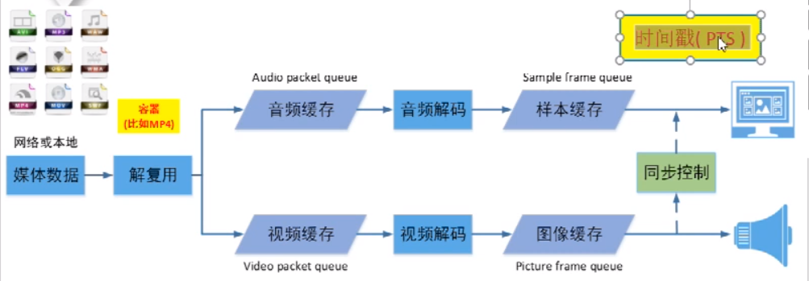
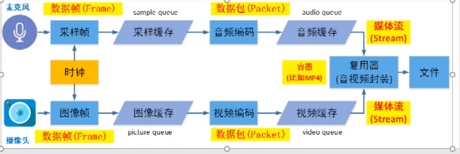
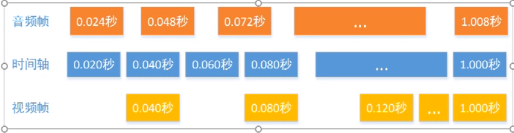
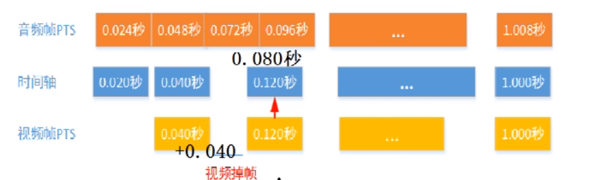
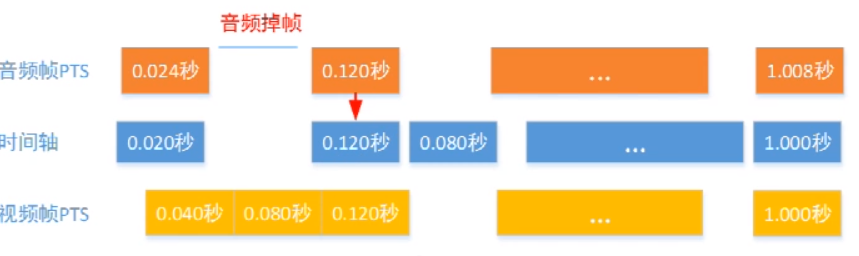
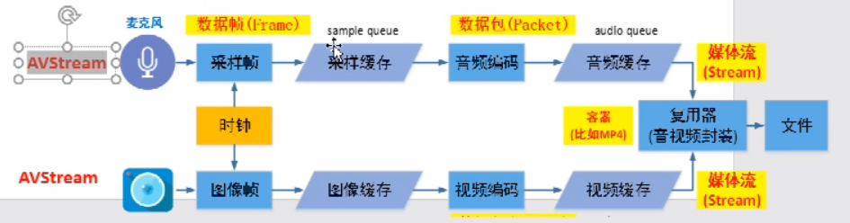
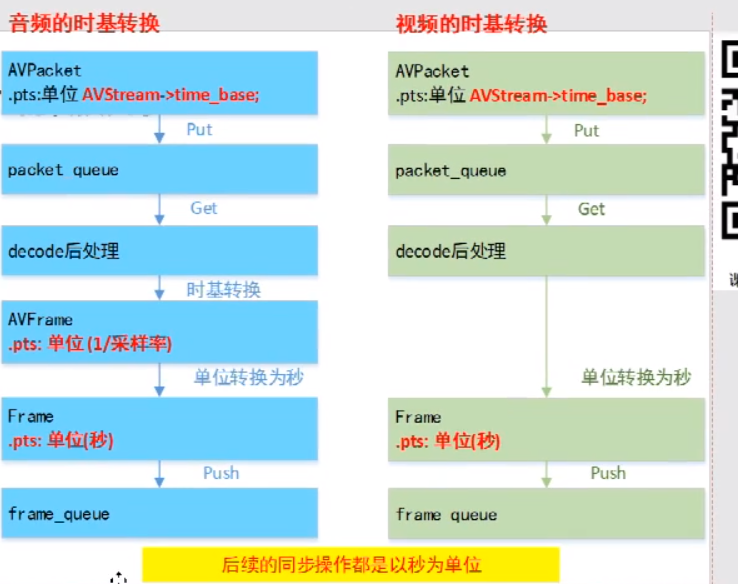

### 音视频同步

学到什么？

1，音视频同步的方式

2，不同音视频同步方式的逻辑

3，该优先选择哪一种同步方式

4，FFMPEG不同时间基的转换

5，ffplay是怎么去实现3种不同的同步方式




同步控制，是**通过时间戳（PTS）来控制的**，PTS是通过哪里来的？

是通过视频录制的时候，就会打上一个时间戳.(如下图)，在播放的时候，就会根据这个时间来做同步了。但是具体的策略还是比较复杂的。





**PTS:(Presentation Time Stamp) 即 显示时间戳**，这个时间戳用来告诉播放器该在什么时候显示这一帧的数据。或者播放这一帧的数据。

### 什么是音视频同步？

#### 音视频同步的标准

- 音视频同步的标准其实是一个非常主观的东西。

- **比如 【-100~+100ms】**（在这个区间，就可以认为是一个同步的效果）

  - **喇叭【-60，+30】ms  过标准的时候，是这个区间**
  - 蓝牙音箱【-160,60】ms( 基本没法做到【-60，+30】，蓝牙协议本身延迟所致)
  - 功能设备【-100，+40】ms

- 负值代表音频落后视频，正直代表音频领先视频。

- **音视频同步认证**

  - 杜比音效认证 （电影院音效 效果 笔记本卖点）
  - 美国Netflix认证  （美国最大的音视频源提供商，比如：智能电视）

- **如何测试音视频同步情况？**

  - 当然你可以直接播放一段相声，然后目测声音和嘴型是否对的上 + 打印音视频PTS
  - 通过播放特定的测试片源（图像是黑白交替，声音间隔滴一声），并测试声音和屏幕亮度的变化，并检测声音和屏幕亮度的变化，评判声音是落后于视频，还是领先于视频。用示波器测试或者用Sync-One设备

  

### 音视频同步原理

#### 音视频同步的三种方式

- **以视频为基准**，同步音频到视频
  - 音频慢了则加快播放速度 或者 丢掉部分音频
  - 音频快了则放慢播放速度。
- **以音频为基准**，同步视频到音频
  - 视频慢了，则加快播放或丢掉部分视频帧
  - 视频快了则延迟播放，继续渲染上一帧。
- **以外部时钟为基准**，同步音频和视频到外部时钟
  - 前两者的综合，根据外部时钟改变播放速度


**正常的速度 如下图**：




#### 视频为基准：



上图所示 **比如缺少了80ms 的这帧**，**相当于把80ms 强行设置为120ms.**

那么这个**音频就要跟视频的节奏去切换了**。所以：

以**视频同步为基准**时，如果视频出现了**丢帧**，有如下两种策略：

1，音频也响应丢帧（听觉->突然有声音）

2，音频加速播放速度（听觉->突然声音加速）

**以谁为同步基准的时候，这个时间轴就由谁来维护。**


#### 音频为基准

音频同视频也是一样的道理。



以音频为同步基准时，如果音频出现了掉帧，此时视频应该怎么处理？

1，视频也响应丢帧（视觉->画面跳帧）

2， 视频加快播放速度（视觉->画面快速播放） 具体要看帧率，如果帧率本身很高，就要丢掉部分帧的。

#### 以外部时钟为基准

开发中用的比较少的，**一般是在电视中**，播放TS流中用。**因为TS流本身就带有一个外部时间戳。**

比如 PCR= 300ms 这个时候，audio pts = 100ms  video pts = 200ms

以外部时钟为基准时，如果音视频出现了丢帧，此时音视频应该怎么做？可以参考下面方式

- 当丢帧较多的时，**重新初始化外部时钟**，（**pts和时钟进行对比，超过一定阈值重设外部时钟**，比如超过2秒）


### 音视频时间换算的问题

不同的封装格式，PTS的单位并不是一样的，它是自定义的。

标准时间秒：seconds

自定义时间：（a/b)秒

以音频AAC音频帧举例，如果pts 以1/采样率为单位，比如：44.1khz ,则时间单位是1/44100, 因此pts 是1/44100,因此PTS表示： 

第一帧 PTS2 = 0;

第二帧 PTS1 = 1024;

第三帧 PTS2 = 2048 ;

播放的时候要将pts 换算成秒的单位，则

pts1 = 0*1/44100, 

pts2 = 1024*1/44100 = 0.023秒 , 

pts3 =2048*1/44100 = 0.046439秒

通常：一帧有1024个采样点  **1帧采样了多少次 也就是ffmpeg 中的 nb_samples **

#### FFMPEG中的时间单位

**AV_TIME_BASE**

- 定义 #define AV_TIME_BASE  **1000 000**
- ffmpeg中的内部计时单位（单位基）

**AV_TIME_BASE_Q**

- 定义#define AV_TIME_BASE_Q (AVRaional){1,AV_TIME_BASE}
- ffmpeg 内部时间基的分数表示，实际上它是AV_TIME_BASE的倒数

**时间基数转换公式**

- timestamp{ffmpeg 内部时间戳} =AV_TIME_BASE*time(秒)       换算成秒
- time(秒) = AV_TIME_BASE_Q * timestamp(ffmpeg内部时间戳)   换算成毫秒

#### FFMPEG中的AVRational 

#### **结构体AVRational** 

- ```c++
  AVRational{
  	int num; //分子
  	int den; //分母
  }AVRational;
  ```

#### 将AVRational结构转换成double

```c++
static inline double av_q2d(AVRational a){
	return a.num/(double)a.den;
}
```

#### 计算时间戳

```c++
timestamp(秒)  = pts*av_q2d(st->time_base);
```

#### 计算帧时长

```c++
time(秒) = st->duration * av_q2d(st->time_base);
```

#### 不同时间基之间的转换

```c++
int64_t av_rescale_q(int64_t a,AVRational bq,AVRational cq);
```

### 不同结构体的time_base/duration 分析

time_base 有很多个，如果不掌握，就不知道用哪个time_base 

- f**fmpeg 存在多个时间基准**（time_base ）,**对应不同的阶段**（结构体),**每个time_base 具体的值不一样**，ffmpeg **提供函数在各个time_base 中进行切换**。
- **AVFormatContext** 容器（FLV/MP4） = 音频+视频+组合规则 
  - duration :整个码流的时长，获取正常时长的时候要除以**AV_TIME_BASE**,得到的结果是秒。
- **AV_STREAM**
  - time_base 单位为秒
  - duration 表示该数据流的时长，**以AVStream->time_base 为单位** （**AVFormatContext**  用的是**AV_TIME_BASE**）



#### 不同结构体的pts/dts 分析

​	**不同结构体下，pts和dts使用哪个time_base 分析？**

A**V_Packet 压缩的数据**

- pts: 以AVStream->time_base 为单位
- dts: 以AVStream->time_base 为单位
- duration:以AVStream->time_base 为单位


**AVFrame-> 未压缩的数据**

- pts: 以AVStream->time_base 为单位
- pkt_pts 和 pkt_dts :拷贝自AVPacket 同样:以AVStream->time_base 为单位
- duration: 以:以AVStream->time_base 为单位

#### ffplay中PTS的转换流程分析

```c++
typedef struct Frame{
	***
	AVFrame * frame;
	double pts;   		//时间戳
	double duration;    //该帧持续时间
	****
}
```

ffplay在重新封装AVFrame的时候自己也有pts 和 duration 变量。

- 为什么需要这两个变量，而且是浮点数。单位是秒，单帧0.023秒，0.040秒
- 这两个变量的单位又是什么？




如图：音频做了一个时间基的转换，是为什么？

双卡会指定一个采样率去播放，解码解成一个其他的采样率，都会转成同样的一个采样率播放。


#### Video Frame PTS的获取

```c++
frame->pts = av_frame_get_best_effort_timestamp(frame);
```

#### Audio Frame PTS的获取

Ffplay有3次对audio 的pts进行转换

第一次： 将其由AVStream->time_base 转换为（1/采样率）

```c++
frame->pts  = av_rescale_q(frame->pts,av_codec_get_pkt_timebase(d->awctx),tb);
```

第二次：将其由(1/采样率)转换成秒

```c++
af->pts = (frame->pts == AV_NOPTS_VALUE)?NAN:frame->pts*av_q2d(tb);
```

第三次：根据实际情况拷贝给sdl的数据长度做调整

```c++
audio_pts= is->audio_clock-(double)(2*is->audio_hw_buf_size + is->audio_write_buf_size)/is->audio_tgt.bytes_per_sec;
```

### ffplay 同步时钟的问题

#### 时间轴

- 不管是哪种同步方式，都需要维护一个时钟，以谁为基准（master） 那就谁可以set时钟，其他的则只能get该时钟
- ffplay 中的时间轴是以av_gettime_relative() 为基础。线性增长的时间。
- 相对时间差 pts_drift